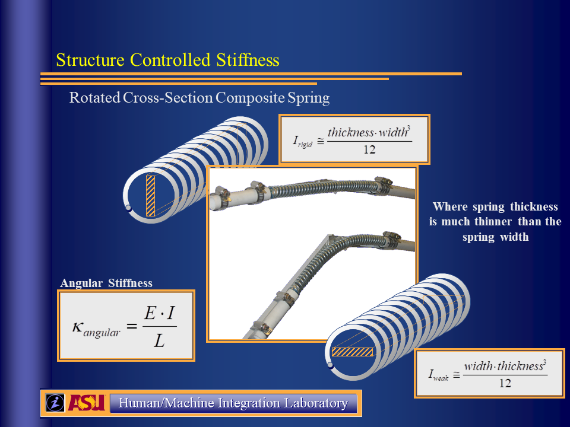

## ECS - Equilibrium Controlled Stiffness

Control the input side of the spring to adjust the virtual stiffness and pre-load force

We designed a robotic tendon actuator for powered prostheses and orthoses [Equations](ecs slide.png)

## SCS - Structure Controlled Stiffness

Adjust the structure of springs to change the stifness properties

### Jack Spring Technology

A nut is actively driven into the helical pattern of coil spring.  The spring stiffness and length are both adjusted at the same time. [Jack Spring](jack spring.png)

### Leaf Spring Technology

Change the length of the leaf spring [Length](scs slide1.png)

Rotate a leaf spring to chagne the structure 

<!--   -->
<!-- [Rotate](scs slide2.png) -->

