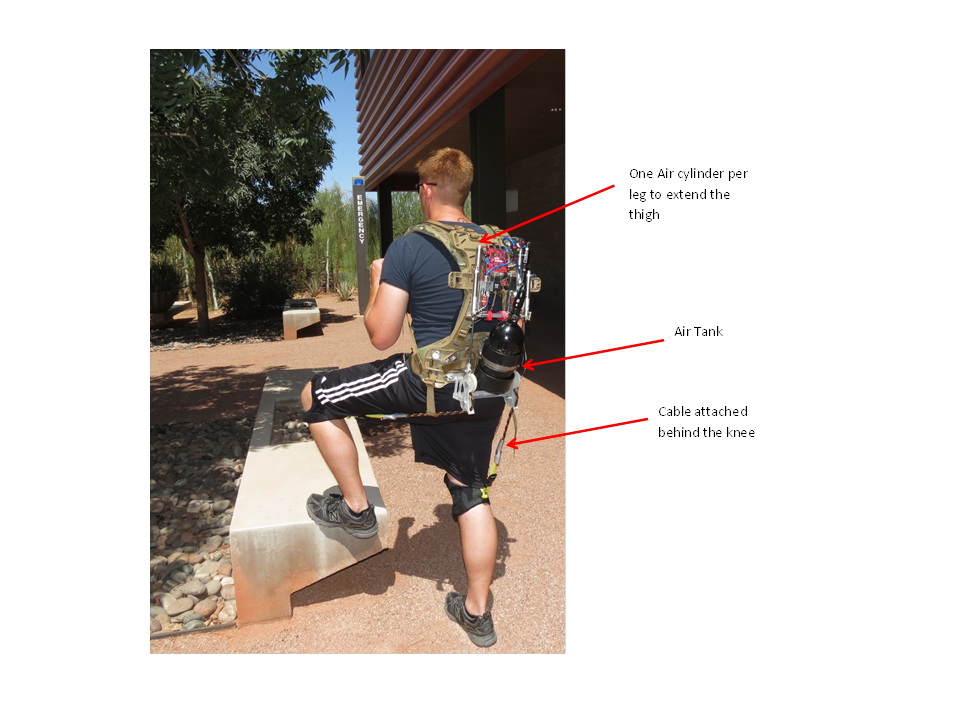
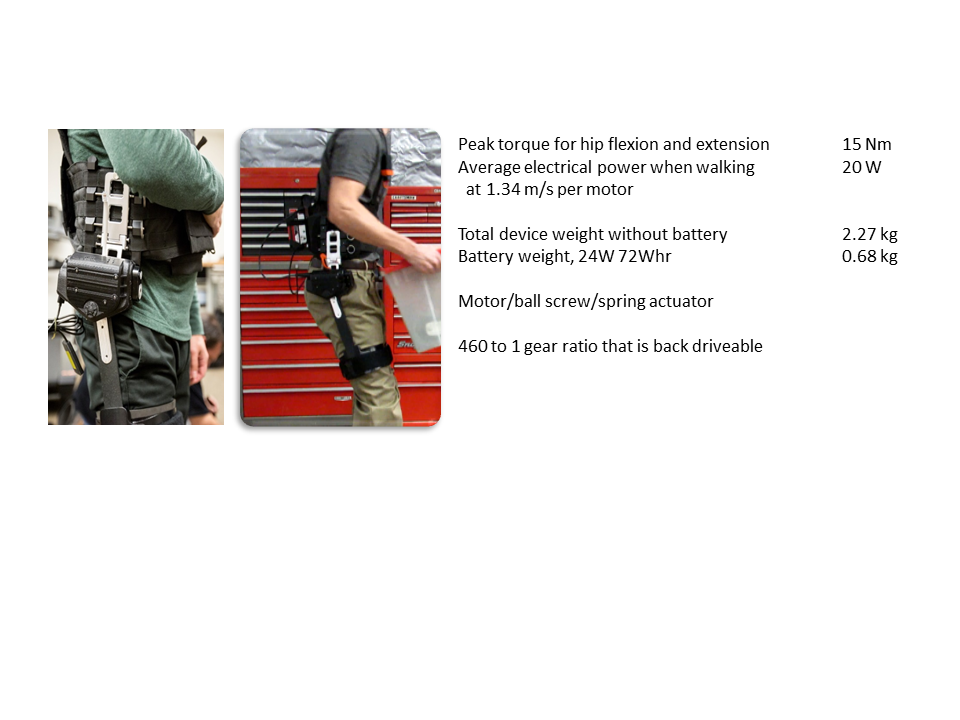
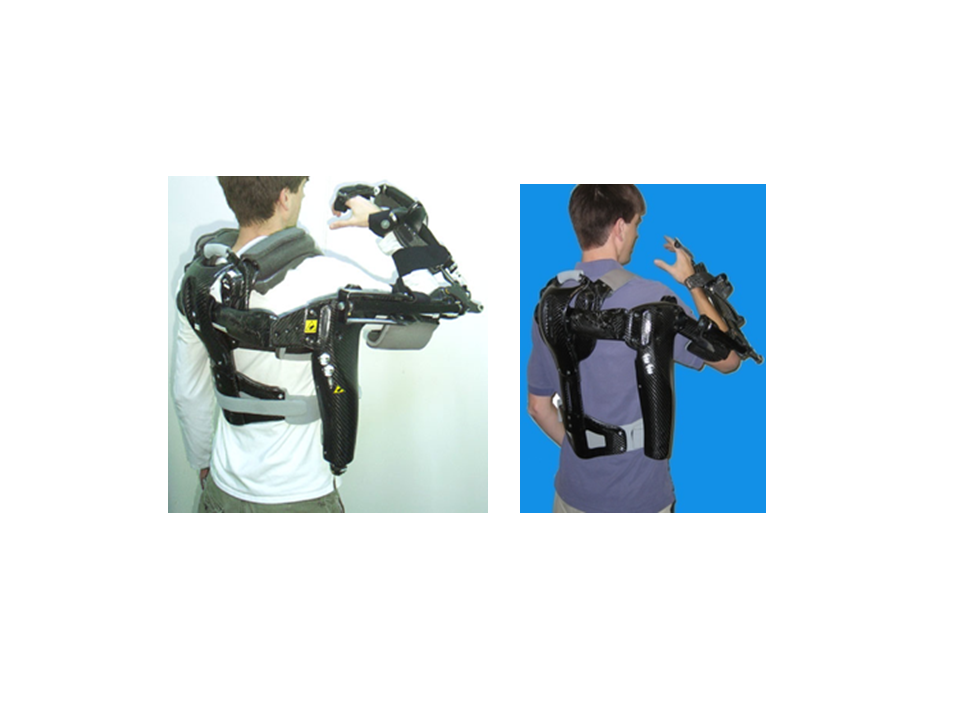

## Airlegs

Developed a soft exoskeleton to enhance running

Running in the version 1 device
  [Airlegs video](assets/images/AIRLEGSvid.wmv)

## HESA (Hip Exoskeleton for Superior Assistance)

* Developed a motor/spring exoskeleton to extend and flex the hips.

* It uses a phase oscillator controller to synchronize with the human movement.

* Can your exoskeleton make these moves? [movie](Hesa Moves compress.mp4)

## JTAR Hip and Ankle system (Designs and Controller owned by SpringActive)

Overview
* <a href="https://www.youtube.com/watch?v=TPNQDAOygnY" title="JTAR video"> JTAR Hip and Ankle system

Can you run and jump over walls?

* <a href="https://www.youtube.com/watch?v=8Y1_pXU3FQU" title="JTAR video2"> JTAR Hip and Ankle system

## RUPERT (A device for Robotic Upper Extremity Repetitive Therapy)

* Co-investigator on an upper extremeity device, Dr. Jiping He was the PI

* RUPERT on ABC World News, May 17, 2005 [movie](assets/images/ABC World News Tonight2.wmv)

 
