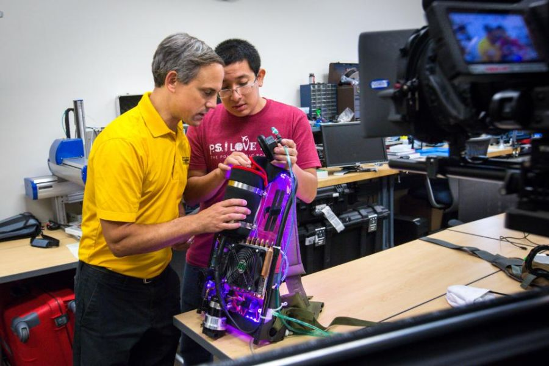

## Research Thrusts

  

    

      

        <h3 class="panel-title">Compliant Actuators</h3>
      

      

        1. Focused on spring based actuators using Equilibrium Controlled Stiffness and Structure Controlled Stiffness
      

    

  

  

    

      

        <h3 class="panel-title">Prosthetics and Orthotics</h3>
      

      

        1. Designed powered prosthetic ankles and orthoses  
        2. Co-investigator on projects to assist Stroke Survivors: RUPERT and Foot Mentor  
        3. Co-founder of SpringActive, Inc
      

    

  

  

    

      

        <h3 class="panel-title">Exoskeletons</h3>
      

      

        1. We designed hip exoskeletons, HeSA, AirLegs, and PogoSuit  
        2. We use a Phase Oscillator Controller.  
        3. Member of the ASTM F48 Committee
      

    

  

    

    

      

        <h3 class="panel-title">Wearable Robotics</h3>
      

      

        1. Wearable Robotics Association  
        2. Designed a jetpack to enhance running
      

    

  

  

  
------

## News

* Can your exoskeleton make these moves?

* <a href="https://exoskeletonreport.com/2018/03/wearracon18-day-one-report/" title="WearRAcon 2018">
WearRAcon 2018

* <a href="https://exoskeletonreport.com/2017/04/wearracon17-day-one-report/" title="WearRAcon 2017">
WearRAcon 2017

* <a href="https://exoskeletonreport.com/2016/02/wearracon16_day_1_report/" title="WearRAcon 2016">
WearRAcon 2016

* Dr. Jeff Ward designing a rugged, waterproof <a href="http://cdmrp.army.mil/pubs/video/op/jeff_ward_video.aspx" title="Ruggedized Ankle"> prosthetic ankle for walking and running   
  
 <a href="https://www.facebook.com/selfmadeshow/videos/168740210356518"> Second video  
 
 * <a href="https://www.amazon.com/Wearable-Exoskeleton-Systems-applications-Robotics/dp/1785613022"> Wearable Exoskeleton Systems: Design, control and applications  
  

