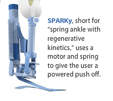

## In the Press

### Jetpack

* #### <a href="https://vimeo.com/98084869" title="ASU Jetpack"> ASU Jetpack, 2.2 million hits

* <a href="https://vimeo.com/154121885" title="ASU Jetpack2"> ASU Jetpack

* <a href="http://kjzz.org/content/71534/asu-researchers-develop-jetpack-technology-help-ground-troop-mobility" > KJZZ story

* <a href="https://www.redorbit.com/news/technology/1113233473/jetpack-and-exoskeleton-receive-darpa-funding-091414/" > ASU Jetpack

* <a href="https://www.richarddawkins.net/2014/09/jetpack-keeps-you-grounded-but-faster/" > ASU Jetpack

* <a href="http://www.statepress.com/article/2014/09/asu-student-develops-4mm-jetpack-that-blows-people-away" > ASU Jetpack

* <a href="https://www.pcmag.com/article2/0,2817,2468458,00.asp" > ASU Jetpack

* <a href="https://www.runnersworld.com/newswire/jetpack-said-to-improve-running-speed" > ASU Jetpack

* <a href="https://www.engadget.com/2014/09/13/darpa-jetpack-soldiers-runner/" > ASU Jetpack, engadget

* <a href="https://hackaday.com/2014/09/06/finally-a-working-jet-pack/" > ASU Jetpack, hackaday

* <a href="https://www.si.com/edge/video/2014/11/20/edge-asu-scientist-builds-real-life-jetpack-for-runners" > ASU Jetpack, Sports Illustrated

### ASU Press

* <a href="https://asunow.asu.edu/20170207-solutions-rehab-robotics-field-promises-return-control-mobility-aging-population" > Rehabilitation Robotics
  
### Wearable Robots

* <a href="https://www.abc15.com/news/region-southeast-valley/tempe/arizona-state-university-professor-proving-robots-arent-a-threat-to-humans-in-the-workplace" > Exoskeletons for Industry
  
* <a href="http://www.statepress.com/article/2015/10/asu-iron-man-lab-creates-change" > Exos in the lab
  
* <a href="http://www.nationaldefensemagazine.org/articles/2016/8/1/2016august-how-technology-could-create-super-soldiers" > Exos for enhanced strength and movement
  
* <a href="http://www.businessinsider.com/pentagon-iron-man-exosuit-making-strides-2016-9" > Warrior Web Program
  
### WearRAcon 17

* <a href="https://asunow.asu.edu/20170414-asu-engineering-professor-tom-sugar-explores-next-step-wearable-robotics-wearracon17" > WearRAcon 17
  
* <a href="http://www.fox10phoenix.com/news/arizona-news/worldwide-companies-show-off-new-inventions-in-phoenix" > WearRAcon 17
  
### AirLegs

* #### <a href="https://www.cbsnews.com/news/militarys-darpa-lab-creates-wearable-robot-to-help-soldiers-run-faster/" title="ASU AirLegs"> ASU Airlegs, CBS Good Morning News

* <a href="https://www.popularmechanics.com/military/research/a11673/the-iron-man-suit-in-real-life-is-coming-darpa-17493769/" > Popular Mechanics
  
* <a href="https://www.youtube.com/watch?v=qsQK979_XBs" > Airlegs
  
* <a href="https://hackaday.com/2014/09/07/airlegs-augment-your-cardio-by-10/" > Multiple videos

### Powered Prosthetic Ankle

Featured in the January 2010 National Geographic Magazine, "The Bionic Age"

* <a href="https://www.youtube.com/watch?v=vLQrAnU0KB8" > SPARKy, Spring Ankle with Regenerative Kinetics

* <a href="https://www.youtube.com/watch?v=bSUYTEJDiNE" > SPARKy, very first steps

* <a href="https://www.youtube.com/watch?v=hNEnCfkxGzU" > Rugged Ankle
  
* <a href="https://www.youtube.com/watch?v=-H-KqhGOo6M" > The Dean of Invention
  
### RUPERT

* RUPERT - PI, Dr. Jiping He

* RUPERT on ABC World News, May 17, 2005 [movie](assets/images/ABC World News Tonight2.wmv)

### Pogosuit

* <a href="https://asunow.asu.edu/20170414-solutions-pogo-pack-asu-innovator-creates-wearable-trail-tech-%E2%80%94-and-we-put-it-test" > Pogosuit testing on the Peralta Trail

* <a href="https://www.youtube.com/watch?v=JtBzph2ptMg&feature=youtu.be" > Pogosuit
  
### Spiderman Suit

* <a href="https://vimeo.com/55449506" > Spiderman suit
  
### Cooling Suit

* <a href="https://vimeo.com/124718983" > Cooling Suit
  
### Human Navigational Principles: Ball Catching with Prof. M. McBeath

* <a href="https://www.nytimes.com/2006/06/10/sports/baseball/10robot.html" > Ball Catching, NY Times, Sports Saturday
  
* <a href="https://www.nytimes.com/2006/12/10/magazine/10section3a.t-8.html" > Ball Catching, The Sixth Annual Year in Ideas, NY Times, Sports Saturday
  
  
