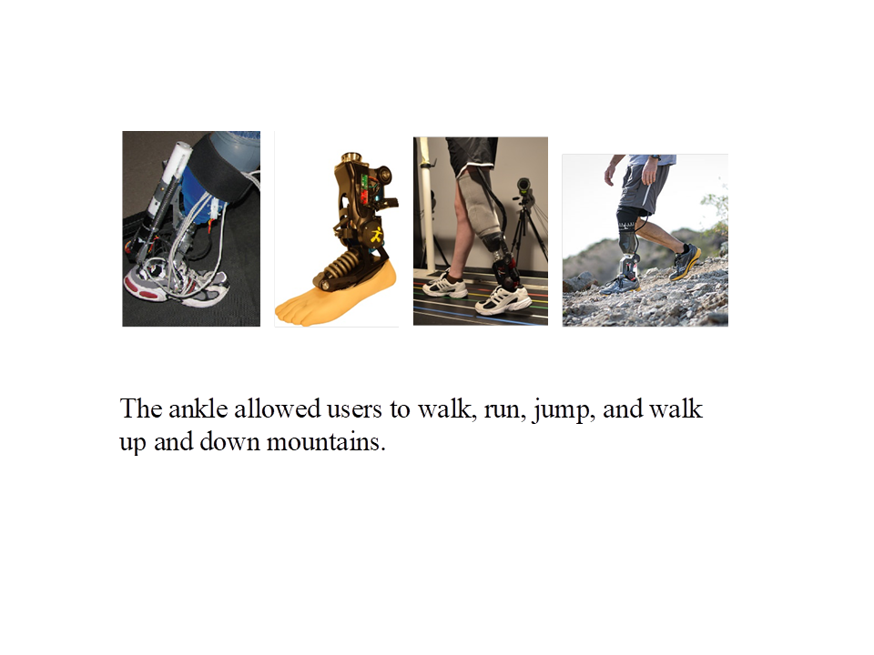
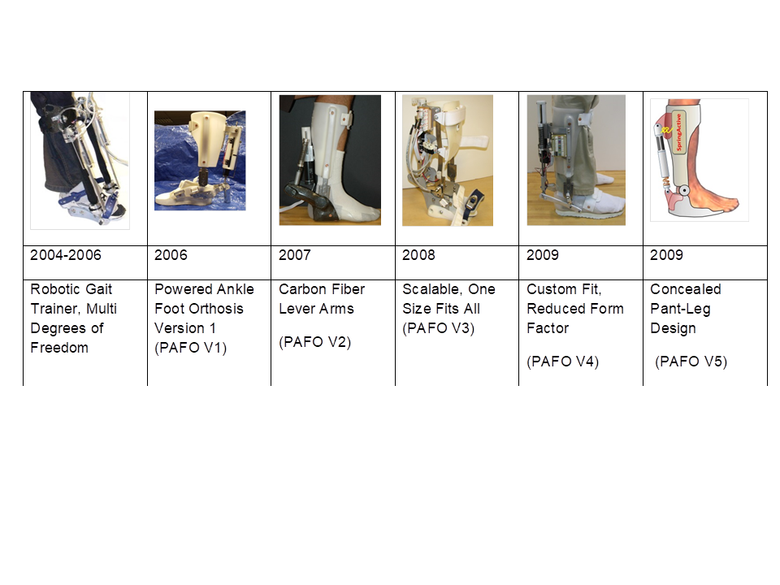
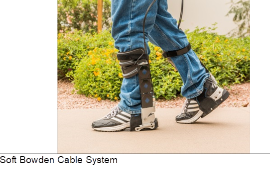

## Prosthetic Ankles

Developed powered prosthetic systems. SPARKy (Spring Ankle with Regenerative Kinetics)

## Prosthetic Systems that allow volitional control (ASU patent)

[Get your feeling back](assets/images/feelingback.wmv)

## Orthoses

Developed powered anlke foot orthoses PAFO

## Soft Bowden Cable Systems

Developed a JTAR (Joint Torque Augmentation Robot) that uses Bowden cables to pull and apply torque at the ankle

## Crutchless Cast developed in 2003-2004

First steps
[video](assets/images/crutchlesscast.wmv)
