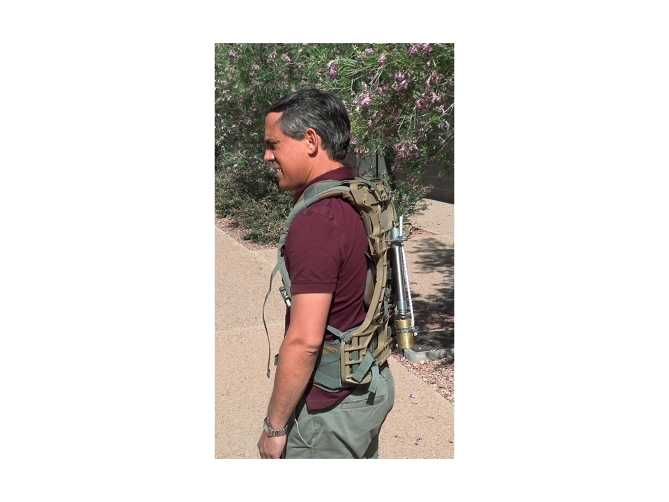
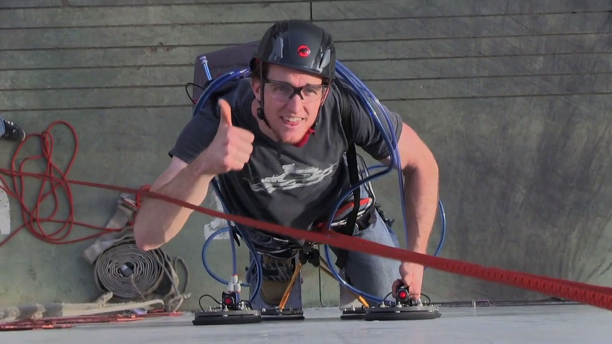
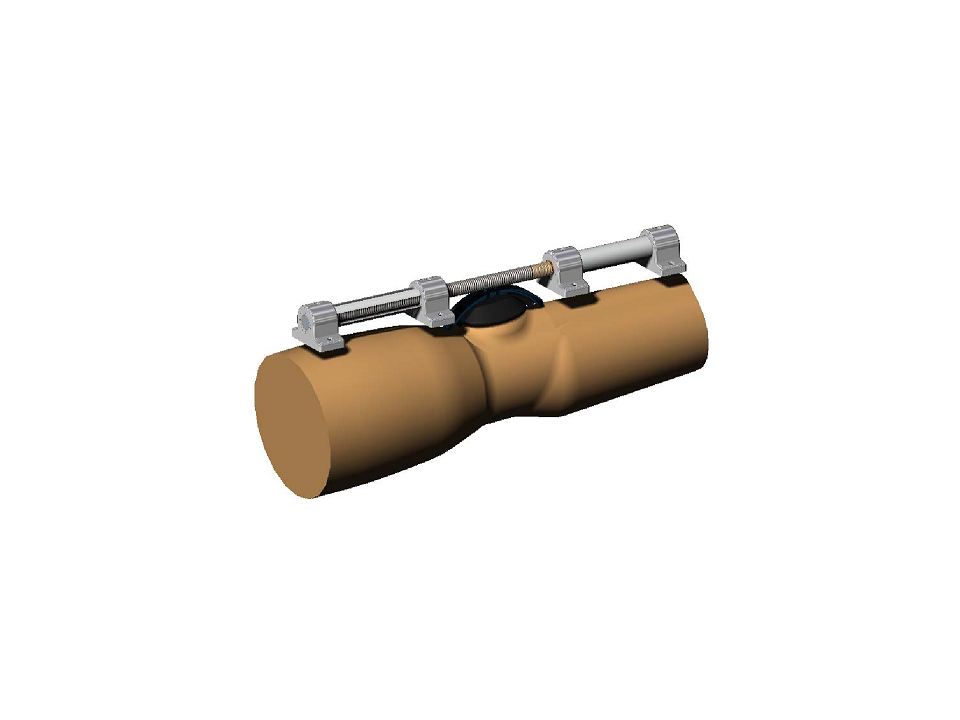

Co-founded Wearable Robotics Association <a href="http://www.wearablerobotics.com">http://www.wearablerobotics.com</a>

Please see our HESA, Airlegs, and RUPERT devices

### Jetpack
Enhance running with the wind at your back

* <a href="https://vimeo.com/98084869" title="ASU Jetpack"> ASU Jetpack, 2.2 million hits

### Pogosuit
Mass oscillates up and down with your motion

* <a href="https://asunow.asu.edu/20170414-solutions-pogo-pack-asu-innovator-creates-wearable-trail-tech-%E2%80%94-and-we-put-it-test" > Pogosuit testing on the Peralta Trail

### Cooling Suit - Dr. Sangram Redkar was the PI

### Spiderman Suit - Dr. Sangram Redkar was the PI
* <a href="https://vimeo.com/55449506" > Spiderman suit

### Sit to Stand
Adjustable leaf springs were used to assist when moving from a sitting position to a standing position

### Spring Loaded Knee
A Jack Spring actuator was mounted across the knee. The stiffness could be adjusted quickly from soft to very stiff.

### Energy Harvesting Ankle - Work with SpringActive and Dr. Joseph Hitt

