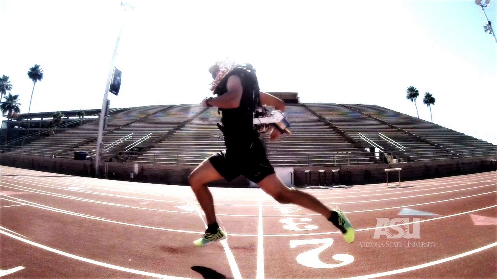
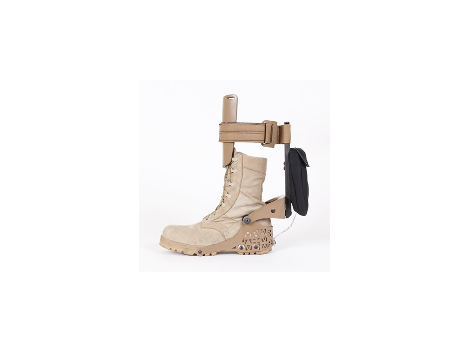

Co-founded Wearable Robotics Association <a href="http://www.wearablerobotics.com">http://www.wearablerobotics.com</a>

Please see our HESA, Airlegs, and RUPERT devices

# Jetpack
Enhance running with the wind at your back

* <a href="https://vimeo.com/98084869" title="ASU Jetpack"> ASU Jetpack, 2.2 million hits

# Pogosuit
Mass oscillates up and down with your motion

* <a href="https://asunow.asu.edu/20170414-solutions-pogo-pack-asu-innovator-creates-wearable-trail-tech-%E2%80%94-and-we-put-it-test" > Pogosuit testing on the Peralta Trail

# Cooling Suit - Dr. Sangram Redkar was the PI

# Spiderman Suit - Dr. Sangram Redkar was the PI
* <a href="https://vimeo.com/55449506" > Spiderman suit

# Sit to Stand

# Spring Loaded Knee

# Energy Harvesting Ankle - Work with SpringActive and Dr. Joseph Hitt

